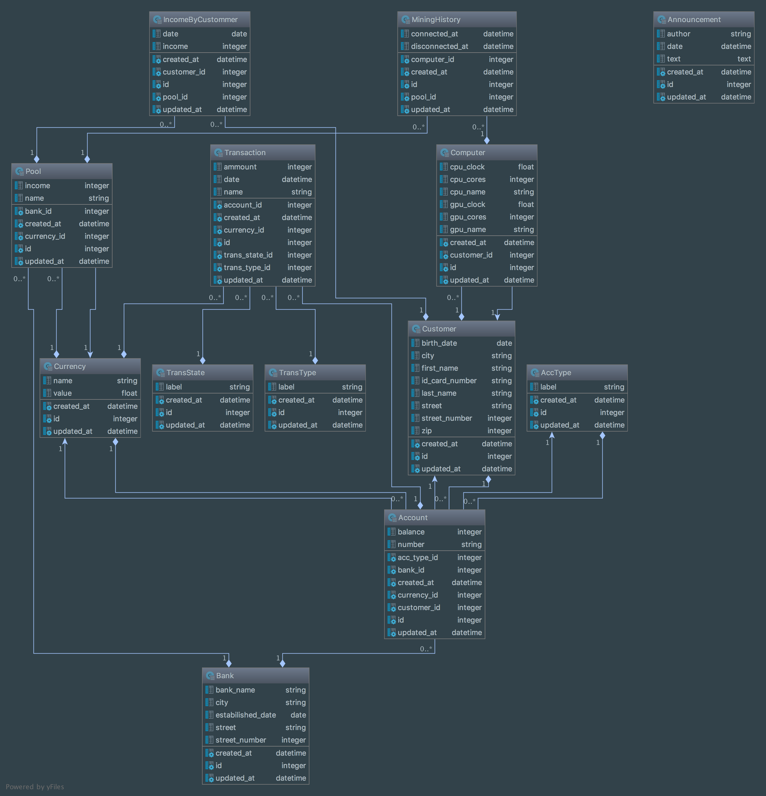

# Dokumentacia - DBS 2018 CRYPTOBANK 
### Richard Krizan, Tomas Mizera

## O projekte

Kryptomeny sú v dnešnej dobe veľmi populárne, vďaka tomuto trendu vznikajú rôzne zaujímavé projekty v oblasti IT, bankovnícta a všeobecne projekty spojené s financiami. V projekte sme sa rozhodli namodelovať systém pre banku, ktorá operuje s kryptomenami namiesto klasických peňazí. Banky obchodujúce s kryptomenami ponúkajú svojim zákazníkom tzv. "mining pooly", ktoré v oblasti bankovníctva predstavujú paralelu investičným fondom. Do takýchto poolov sa môže zákazník banky prihlásiť, resp. zapojiť do ťazby kryptomien so svojím počítačom. Zisk v mining pooloch sa rozkladá na 2 časti, jedna je provízia pre banku za poskytnutie možnosti zapojenia sa do ťažby v jej pooloch a druhá časť sa rozkladá medzi zákazníkov, ktorí sú v danom poole zapojení.

V systéme sa bude dať pozrieť na rôzne mining pooly, ich výnosnosť, tiež na zákazníkov konkrétnej banky, ich počítače a to, do akých poolov sú zapojení a koľko v nich zarábajú. Každý zákazník banky v nej má otvorený účet, na ktorom prebiehajú transakcie rôzneho typu, podobne ako v klasickej banke.

Program je napísaný v jazyku Ruby s frameworkom on Rails s postgresql databázou. Dáta boli vygenerované pomocou nástroja Faker (includovaný ako gem do Rails). Kód generujúci dáta sa nachádza v zložke scheme, súbor generovanie_dat.sql

## Databáza

### Model databázy

### Opis entít

Databáza má 8 entít a 4 číselníky.
Entity:
* customers
* computers
* accounts
* transactions
* banks
* pools
* mining_histories
* income_by_customers

Číselníky:
* acc_types - typ účtu
* trans_states - stav transakcie
* trans_type - typ transakcie
* currencies - kryptomeny 

#### customers
Entita customers predstavuje jednotlivých zákazníkov bánk, ich mená, dátum narodenia, čísla OP a podobne. Kardinalita vzťahov na strane customers je vždy 1 (napr. počítač patrí jednému zákazníkovi, účet patrí jednému zákazníkovi). Customers majú many-to-one vzťah s troma entitami: computers, accounts a income_by_customers, kde customers sú teda vždy tí, kde je kardinalita one.

#### Computers 
Predstavujú počítače zákazníkov, jeden zákazník ich môže mať viacero, aj žiadne. Atribúty entity computers opisujú jeho výkon (cpu clock, cpu cores, gpu cores,..). Počítače sú vo vzťahu s entitou zákazníkov a entitou mining_history

#### Accounts
Táto entita predstavuje účet zákazníkov, opäť platí že zákazník môže mať viacero účtov. Má svoje číslo, majiteľa (FK na customers), typ účtu (FK na typ účtu), menu v ktorej je vedený (FK na currencies), zostatok a banku ku ktorej je účet priradený (FK na banks). Entita accounts je vo vzťahu k transakciám (môže ich mať viac), patrí k jednej banke a má svoj typ (z číselníka).

#### Transactions
Transakcie prebiehajú medzi účtami, medzi poolom a účtom (na prevod zisku, prip. straty za ťaženie), medzi bankou a zákazníkom (zaplatenie poplatku za vedenie účtu) a pod. Obsahuje atribúty ako typ platby, sumu, odosielateľa platby, menu v akej sa platba realizuje a má svoj stav (uhradená, blokovaná,..). Je vo vzťahu k entite accounts, kedy jeden účet môže mať viacero transakcií a jedna transakcia patrí práve jednému účtu. Tiež je vo vzťahu k viacerým číselníkom: trans_state (stav transakcie), trans_type (typ transakcie) a currencies (mena v ktorej sa prevádzajú peniaze).

#### Banks
Entita rôznych bánk, pre ktoré sa systém vyvýja, každá má svoje meno, adresu a dátum kedy bola založená. Je vo vzťahu ku 2 entitám: accounts a pools. Jedna banka môže mať viacero účtov a zároveň viacero mining poolov. 
Kryptobanky sú v dnešnom svete veľká novinka, preto sa môže stať že niektorá (začínajúca) banka ešte nemá vytvorené pooly.

#### Pools
Predstavuje mining pools banky, do ktorých môžu jej zákazníci pristupovať so svojimi počítačmi a podieľať sa na ťažení kryptomien. Je vedený v určitej mene (FK na currencies), patrí určitej banke (FK na banks), má meno a príjem.
Je vo vzťahu k číselníku currencies a entitám banks, mining_histories (jeden pool môže mať viacero záznamov ktorý počítač kedy ťažil) a income_by_customers (jeden pool má viacero záznamov o príjmoch pre zákazníkov).

#### Income_by_customers
Entita income_by_customers predstavuje väzobnú entitu medzi poolom a customerom, doplnenú o ďalšie atribúty, takže tvorí plnohodnotnú entitu. Slúži pre zákazníkov pre evidenciu ich zisku z daného poolu. Obsahuje teda FK na entitu pools a customers, ďalej dátum (obdobie) ktoré predstavuje a hodnotu (finančný výsledok zisk/strata pre zákazníka).

#### Mining_histories
Mining_histories je taktiež väzobná entita pretransformovaná na plnohodnotnú, no v tomto prípade ide o spojenie tabuľky pools a computers. Pre každý počítač treba vedieť do akého poolu poskytoval svoj výpočtový čas a taktiež kedy sa do daného poolu pridal, resp. kedy z daného poolu odišiel.

## Zhodnotenie
Projekt simuluje systém, ktorí si v budúcnosti vieme reálne predstaviť, online kryptobanky poskytujúce pooly pre jej zákazníkov. Práca na projekte je preto o to efektívnejšia, zábavnejšia a užitočnejšia. 

najbližšie TODO:
* pridať indexy do databázy aby sa s ňou dalo rýchlejšie pracovať
* vytvorenie reportov v systéme (prepojenie viacerých tabuliek), napr. report pre jeden počítač, koľko kedy a v akom poole zarobil, a pod.
